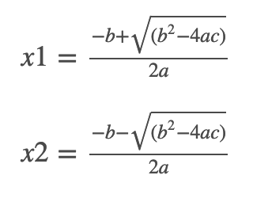

# [Roots of a Quadratic Equation](https://www.codechef.com/problems/QUADROOT)
Problem Code: **QUADROOT**

Write a program to take the values for A, B, C of a quadratic equation **_A ∗ X2 + B ∗ X + C_ = 0** and then find all the roots of the equation. It is guaranteed that A ≠ 0 and that the equation has at least one real root.


## Input

- First line will contain the value of **_A_**
- Second line will contain the value of **_B_**
- Third line will contain the value of **_C_**

## Output

Output two lines. First line contains the value of root 1 (x1) and second line contains the value of root 2 (x2). Your output will be considered to be correct if the difference between your output and the actual answer is not more than **10^−6**.

## Usage
```sh
node .
```
## Example
### Input:
```
1
-8
15
```
### Output:
```
5
3
```

## Coder

* **Tejas Rathod** - [@tejas77](https://github.com/tejas77)
